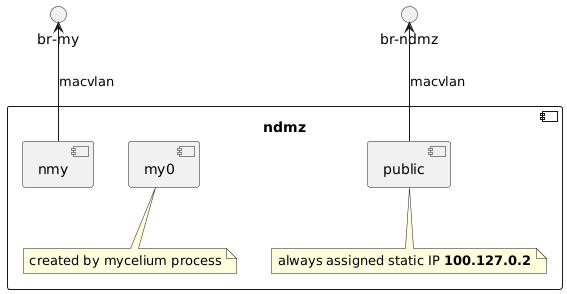
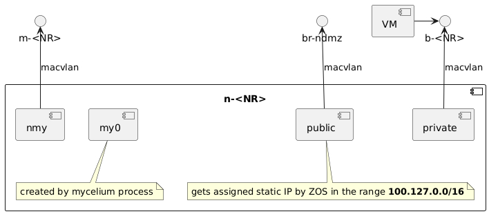
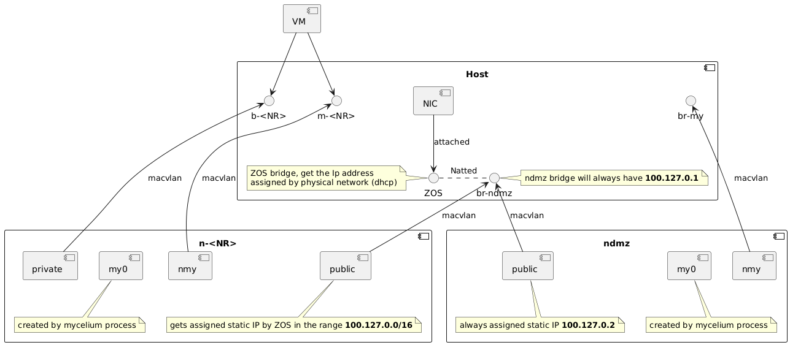

# Network Light

> WIP:  This is still a draft proposal

Network light is a new version of network daemon that simplifies zos setup on most of cloud providers so ZOS can be deployed and hosted on the cloud. This version of networking has a small set of requirements and features as follows:

- VMs have (Always) two IPs.
  - A local private IP. This only allows the VM to have access to the public internet via NATting. So far it's not relevant if that IP subnet and IP is assigned by the user or ZOS itself
  - A mycelium IP. The mycelium IP subnet is chosen by the user during deployment for his entire *network space* on that node (by providing the seed) and then he can chose individual IPs per VM that is deployed in that space.
- Different *network space* has isolated networks. VMs from different spaces can't communicate over their private Ips, but only over their mycelium Ips.
- If the user wants his VMs across multiple node to communicate it's up to him to setup mycelium ips white lists or other means of authentication.
- There is NO public IP support.
- ZDBs only have mycelium IPs.
- No yggdrasil
- No public config

## Network layout

This is to layout the simplified version of networkd. This version makes sure that ZOS gets only a single IP (via the cloud provider) and then all traffic from that node is basically NATted over this IP.

### Host namespace


- The physical (only) nic is directly attached to the ZOS bridge.
- There is a dhcp client instance running on zos bridge that gets an IP from the physica network.
- There is created an **ndmz** bridge that is set to UP and statically assigned an IP address `100.127.0.1`
  - This bridge will be wired later to other namespaces
- The `br-my` bridge is created.
  - This bridge will be wired later to `zdb` namespaces so they can get mycelium IPs.
- nft rule to drop connection to `100.172.0.1`

The usage of `br-ndmz` and `br-my` bridges will be clear later

> **SAFETY:** All incoming connections to ip `100.127.0.1` is dropped via nft rule. This will prevent VMs from being able to connect to the node directly.

## Ndmz namespace


The ndmz namespace is a much simplified version of the previous layout.
The key difference here is that ndmz does **NOT** have an IP from the physical LAN instead it is also natted over the same node IP.

The reason we need it is we can safely run services that need to be accessed remotely over the node mycelium IP. Like the NODE openRPC api. But also prevent attackers from reaching to other services directly running inside the host

The node mycelium instance will also be running inside `ndmz` this process will then create the `my0` interface and give it the seed associated ip address. For example let's assume `my0` gets ip `58a:1059:b9a9:bc3:a1e8:5909:8957:d956/7`

According to mycelium docs the entire `/64` prefix is assigned also to that node. We then can do the following:

- Assign the IP `58a:1059:b9a9:bc3::1/64` to nmy
- make sure forwarding is enabled for ipv6
- set routing of `58a:1059:b9a9:bc3::/64` over dev `nmy`
- make sure that `200::/7` is routed over `my0`
- make sure default gw is set to `100.127.0.1` (the br-ndmz on the host)
- enable ipv4 forwarding, and set any needed masquerading rules as needed. `oifname "public" masquerade fully-random`

Later, containers wired to `br-my` can then get IPs inside the range `58a:1059:b9a9:bc3::/64` and they then can send traffic (and receive traffic) over mycelium network

> Note: Again the reason we still have ndmz is to run mycelium isolated from the host, and run API services isolated from rest of the system. It's still possible to simply create the same setup on the host name space directly. Jan?

## NR (Network Resource)



The network resource is yet a simplified version of NR namesapce on original setup but here it looks and behaves more like `ndmz` in the sense that it only to isolate VMs from rest of the system. All public traffic is natter over `public` interface, which is wired to br-ndmz

The `my0`, `nmy`, and `m-<NR>` work in exactly similar way as the ones in `ndmz`. The only difference is that those are user network specific. The user provides the seed and hence control what IP range, and Ips assigned to the VMs. All routing rules has to be done here.

The `b-<NR>` is where all VMs will be connected. Each VM must get an IP range from a private range as follows:

- the private range doesn't really matter, it can be fixed by ZOS forever (say range `10.0.0.0/8`) or allowed to be chosen by the user.
  - I personally prefer to make it fixed to `10.0.0.0/8` range and allow the user to choose individual VMs ips in the private range.
- `private` interface becomes the `gw` hence it can get the first ip in the range as per convention. So `10.0.0.1`
- make sure routing is set as follows:
  - default gw is `100.127.0.1` (the br-ndmz on the host)
- enable ipv4 forwarding, and set any needed masquerading rules as needed. `oifname "public" masquerade fully-random`

What happens now is:

- VMs inside a single space can communicate directly over their bridge.
- Different networks resource can (and well) have conflicting IP and ranges but with no issue since each network is completely isolated from the other ones.

## Private Networks

To reach vms on local nodes using wireguard you need to:

- Deploy a networkwith valid pairs so you can be able to connect to the vm from your machine and add a container to this network.
For example:

```go
WGPrivateKey: wgKey,
WGListenPort: 3011,
Peers: []zos.Peer{
 {
  Subnet:      gridtypes.MustParseIPNet("10.1.2.0/24"),
  WGPublicKey: "4KTvZS2KPWYfMr+GbiUUly0ANVg8jBC7xP9Bl79Z8zM=",

  AllowedIPs: []gridtypes.IPNet{
   gridtypes.MustParseIPNet("10.1.2.0/24"),
   gridtypes.MustParseIPNet("100.64.1.2/32"),

```

> **Note:** make sure to use valid two wg key pairs for the container and your local machine.

- After the deployment the network can be accessed through wg with the following config.

```conf
[Interface]
Address = 100.64.1.2/32
PrivateKey = <your private key>

[Peer]
PublicKey = cYvKjMRBLj3o3e4lxWOK6bbSyHWtgLNHkEBxIv7Olm4=
AllowedIPs = 10.1.1.0/24, 100.64.1.1/32
PersistentKeepalive = 25
Endpoint = 192.168.123.32:3011
```

- Bring wireguard interface up `wg-quick up <config file>`
- Test the connection `wg`


- Then you should be able to ping/access the container `ping 10.1.1.2`


- Then you should be able to ping to the container `ping 10.1.1.2`

### Full Picture


